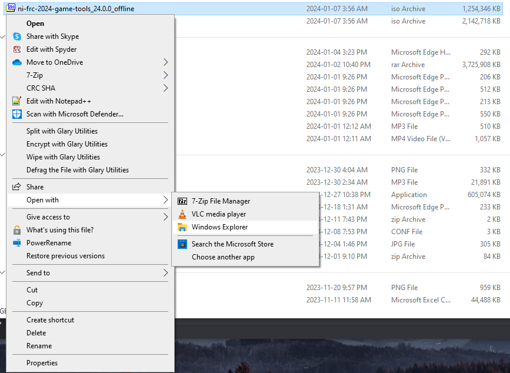
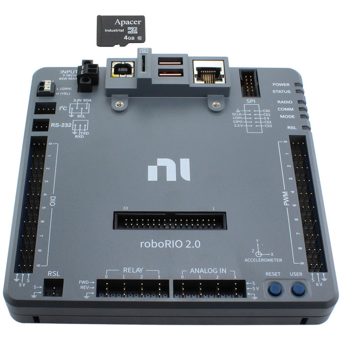
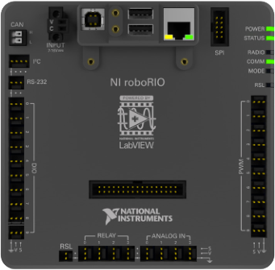

# FRC 2025

| Branch  | Status                                                                                                                                                                           |
| ------- | -------------------------------------------------------------------------------------------------------------------------------------------------------------------------------- |
| main    | [](https://github.com/sonic-howl/frc2025/actions/workflows/integrate.yaml)    |
| develop | [](https://github.com/sonic-howl/frc2025/actions/workflows/integrate.yaml) |

- [FRC 2025](#frc-2025)
  - [Planning](#planning)
  - [Useful Resources](#useful-resources)
  - [Using the Lab PCs](#using-the-lab-pcs)
  - [Build and Deploy Commands](#build-and-deploy-commands)
    - [Running Robot Code](#running-robot-code)
    - [Formatting Code](#formatting-code)
    - [Linting Code](#linting-code)
    - [Using the Driver Station](#using-the-driver-station)
    - [Deploying Code to Robot](#deploying-code-to-robot)
  - [Simulation Testing](#simulation-testing)
    - [Running the Robot Simulation](#running-the-robot-simulation)
    - [Running Robot Dashboards during a Simulation](#running-robot-dashboards-during-a-simulation)
    - [Run Tests](#run-tests)
    - [Add Camera Feed to Shuffleboard](#add-camera-feed-to-shuffleboard)
  - [Getting started](#getting-started)
    - [Installing Wpilib and Other Tools](#installing-wpilib-and-other-tools)
    - [Installing FRC Game Tools](#installing-frc-game-tools)
    - [Installing WPILib 2025 (Python)](#installing-wpilib-2025-python)
      - [Installing Python](#installing-python)
      - [Install VSCode](#install-vscode)
      - [Getting Started with VSCode](#getting-started-with-vscode)
    - [Cloning the GitHub Repository](#cloning-the-github-repository)
    - [Installing RobotPy and Dependencies](#installing-robotpy-and-dependencies)
    - [**Optional:** Creating an Alias](#optional-creating-an-alias)
    - [Setting up PathPlanner](#setting-up-pathplanner)
      - [Deleting old Auto Deployments](#deleting-old-auto-deployments)
    - [Installing OpenCV](#installing-opencv)
    - [Installing Formatter and Linter](#installing-formatter-and-linter)
  - [Configuring Hardware](#configuring-hardware)
    - [RoboRIO Image Update](#roborio-image-update)
    - [Programming the Radio](#programming-the-radio)

## Planning
[Miro - Gantt Chart](https://miro.com/app/board/uXjVLLV_LVY=/?moveToWidget=3458764612561287452&cot=14)

## Useful Resources

- RobotPy Example Repository: https://github.com/robotpy/examples

## Using the Lab PCs

When using the Lab PCs, you're going to want to use your GitHub account so the rest of the team knows who worked on what. If you don't have one, [create one here](https://github.com/signup).

If you're using a lab PC, follow these steps to link your GitHub account to VsCode:

1. Create a new script in the `switch-gituser` folder and use your real name as the name of the file (Ex: create new file `NathanGrenier.sh` in folder `switch-gituser`).
2. Replace the `USERNAME` and `EMAIL` variables in the newly created file with your GitHub username and password.

**Example:**

```bash
# Set your GitHub username and email
USERNAME="{REPLACE ME WITH GITHUB YOUR USERNAME}" # Make sure to remove the {}
EMAIL="{REPALCE ME WITH YOUR GITHUB EMAIL}" # Make sure to remove the {}

git config user.name "$USERNAME"
git config user.email "$EMAIL"

echo "Git user has been set to: $USERNAME ($EMAIL)"
```

1. In order to change VsCode's GitHub credentials, use the script by running the following command:

Windows (PowerShell):
```ps1
bash .\switch-gituser\{THE NAME OF YOUR FILE}.sh
```

> In order to use this option you need to install git (and Git Bash). Make sure to add `C:\Program Files\git\bin\` to your Windows PATH.

Windows (GitBash):

```bash
./switch-gituser/{THE NAME OF YOUR FILE}.sh
```
## Build and Deploy Commands

To view all available robotpy commands, use the following command:

```bash
# Windows
py -3 -m robotpy

# Linux
python3 -m robotpy
```

> You can pass the `--help` argument to see more information about the subcommand.
>
> For example, to see help for the sim command you can do the following:
>
> ```bash
> # Windows
> py -3 -m robotpy sim --help
> 
> # Linux
> python3 -m robotpy sim --help
> ```

### Running Robot Code

In order to run the robot code, use the following command:

```bash
# Windows
py -3 robot.py

# Linux
python3 robot.py
```

> See full guide on running robot code [here](https://robotpy.readthedocs.io/en/stable/guide/running.html)

### Formatting Code

The following command can be used to format the code:

```bash
# Windows
py -3 -m ruff format

# Linux
ruff format
```

When code is pushed to the repository, a workflow will be run to check if the code is properly formatted. If it isn't, you won't be able to merge the code. In order to check if the project is properly formatted, run:

```bash
# Windows
py -3 -m ruff format --check

# Linux
ruff format --check
```

### Linting Code

Code linting is like a spell check for your code. It helps find mistakes and keeps your code neat and consistent, making it easier to read and understand.

To run the linting check, use the following command:

```bash
# Windows
py -3 -m ruff check .

# Linux
ruff check .
```

### Using the Driver Station

This [guide](https://docs.wpilib.org/en/stable/docs/zero-to-robot/step-4/running-test-program.html) shows you how to setup the FRC driver station in order to run your test programs.

### Deploying Code to Robot

You can deploy robot code to a robot you're connected to using:

```bash
# Windows
py -3 robot.py deploy

# Linux
python3 robot.py deploy
```

> Before deploying, make sure you have used the `cd` command to navigate to the `/src` directory. This needs to be done because we only want to deploy the code present in the `/src` folder to the robot (due to memory limitations).

> See full guide on deploying robot code [here](https://robotpy.readthedocs.io/en/stable/guide/deploy.html)

## Simulation Testing

WPILib provides a [simulator](https://docs.wpilib.org/en/stable/docs/software/wpilib-tools/robot-simulation/introduction.html) to test your code without being physically connected to a robot.

### Running the Robot Simulation

A robot simulation is available for testing. Read the full documentation [here](https://docs.wpilib.org/en/stable/docs/software/wpilib-tools/robot-simulation/introduction.html).

You can run it with the following command:

```bash
# Windows
py -3 -m robotpy sim

# Linux and macOS
python3 -m robotpy sim
```

### Running Robot Dashboards during a Simulation

Follow [this guide](https://docs.wpilib.org/en/stable/docs/software/wpilib-tools/robot-simulation/introduction.html#running-robot-dashboards) to enable whichever dashboard you plan on using during the simulation.

### Run Tests

You can also manually run unit tests using:

```bash
# Windows
py -3 -m robot.py test

# Linux
python3 -m robot.py test
```

### Add Camera Feed to Shuffleboard

Follow [these steps](https://docs.wpilib.org/en/stable/docs/software/dashboards/shuffleboard/getting-started/shuffleboard-displaying-camera.html) to display a usb camera feed to the shuffleboard.

## Getting started

### Installing Wpilib and Other Tools

Follow [this guide](https://docs.wpilib.org/en/stable/docs/zero-to-robot/step-2/wpilib-setup.html#wpilib-installation-guide).

> Make sure to select `Tools Only` as we install the software related dependencies in [this section](#installing-robotpy-and-dependencies).

### Installing FRC Game Tools

To install FRC's game tools for 2025, follow [this guide](https://docs.wpilib.org/en/stable/docs/zero-to-robot/step-2/frc-game-tools.html).

> Make sure to choose the most recent version. FRC comes out with patches fairly often throughout the season.

> Note: If you're on windows and you don't see the mount option after right clicking the iso file, you can open the file using `Open with` then `Windows Explorer`.
>
> 

Once installed, you'll have access to these tools:

- FRC Driver Station
- FRC roboRIO Imaging Tool and Images

### Installing WPILib 2025 (Python)

To install the 2025 WPILib programming environment for python, either follow [this guide](https://docs.wpilib.org/en/stable/docs/zero-to-robot/step-2/python-setup.html).

**If you're unsure of what options to choose during the install, follow these steps:**
#### Installing Python

To get started, install python version 3.12.8 from these links and run the installer:

**[Windows](https://www.python.org/ftp/python/3.12.8/python-3.12.8-amd64.exe)**

**Installation Steps:**
1. Select Modify
2. Click Next
3. Select `Associate files with Python` then click install
4. After installing you can check if everything worked by:
     - Opening a terminal (Press the windows key and search for `cmd`)
     - Using the following command to check the version of python installed on your system: `py --version`

---
  
**[MacOS](https://www.python.org/ftp/python/3.12.8/python-3.12.8-macos11.pkg)**

#### Install VSCode

Follow the instructions [here](https://code.visualstudio.com/download) to install VSCode.

#### Getting Started with VSCode

If you're new to VSCode, WPILib's docs have a good [starting guide](https://docs.wpilib.org/en/stable/docs/software/vscode-overview/vscode-basics.html#visual-studio-code-basics-and-the-wpilib-extension) explaining the basics.

> Note: Since our team uses **Python** to program the robot, we can't make use of the WPILib VsCode extension (So there's no need to install it).

### Cloning the GitHub Repository

In order to gain access to the robot code, clone the [Sonic Howl frc2025 repo](https://github.com/sonic-howl/frc2025).

If you don't know how to do this, follow these steps:

1. Open the repository [link](https://github.com/sonic-howl/frc2025) in your browser
2. Click on the **green** `<> Code` button, choose HTTPS and copy the link to your clipboard.
3. Launch the `2025 WPILib VS Code` application.
4. Open the terminal by pressing the `CTRL + ~` keys.
5. Try to navigate to the `code` directory using the following commands:
     - **Windows:** `cd ~; cd code`
     - **Linux / MacOS:** `cd ~ && cd code`
6. If you get an error saying "Cannot find path 'C:\code' because it does not exist." or similar, use the following command to create a new `code` directory: `mkdir code`
7. Enter the command `git clone <<the link you copied here>>`. (The command should look like this: `git clone https://github.com/sonic-howl/frc2025`)
8. Use the following command to open the newly cloned repository: `cd frc2025`
9. From the terminal, you can use the `code .` command to open VsCode in the current directory. Just make sure you're in the `~/code/frc2025` directory before using it (The `~` represents your system's home directory [Example: `C:\Users\Nathan`]).
10. **Extra:** Ask one of the organization admins to add you to the repo. (Neil, Nathan, Ramez).

> If you get an error mentioning that git isn't installed (or that no command named git exists), download and install it [here](https://git-scm.com/downloads).

### Installing RobotPy and Dependencies

Now that you've cloned the project we can proceed to downloading the project's dependencies. 

Depending on your operating system, run the appropriate command in your terminal to install the project's dependencies.

**For Windows**

```bash
# Uninstall old version of robotpy
py -m pip uninstall robotpy
```

```bash
# Install robotpy
py -3 -m pip install robotpy

# You can use the --upgrade flag before the robotpy command to upgrade your version
py -3 -m pip install --upgrade robotpy
```

```bash
# Install project's dependancies
py -3 -m robotpy sync
```

> I got a lot of issues with my python packages since they were previously installed globally. If you encounter any issues with the install, try running this command `py -3 -m pip freeze | ForEach-Object { py -3 -m pip uninstall -y $_ }` to uninstall all of your packages. Then, rerun the installation steps above.

**For Linux and macOS**

```bash
# Uninstall old version of robotpy
python3 -m pip uninstall robotpy
```

```bash
# Install robotpy
python3 -m pip install robotpy

# You can use the --upgrade flag before the robotpy command to upgrade your version
python3 -m pip install --upgrade robotpy
```

```bash
# Install project's dependancies
python3 -m robotpy sync
```

### **Optional:** Creating an Alias

Through the season we're going to be typing `py -3 -m` A LOT. In order to simplify things, we can create an alias for this command.

**Windows:**
1. Open your terminal (In VsCode press `~`, or press the windows key and search for `cmd`)
2. Check if you already have a windows profile file by typing `$PROFILE` in your terminal.
  - If the file doesn't exist create it with `New-Item -Path $PROFILE -ItemType File -Force` 
3. Open the file by using `code $PROFILE`
4. Insert and save this block of code in the file:
    ```ps1
    Set-Alias cl clear
    
    Function pym {
        py -3 -m $args
    }
    ```
5. Reload the profile file by using `. $PROFILE`
6. Now instead of typing `py -3 -m` you can simply use the much shorter command `pym`.
    
> If you get an error saying "running scripts is disabled on this system", use this command to change windows execution policy: `Set-ExecutionPolicy RemoteSigned -Scope CurrentUser`

Here's an example of how you'd use the command before and after adding the alias:
- Before: `py -3 -m pip install robotpy`
- After: `pym pip install robotpy`

### Setting up PathPlanner

Use this command to install PathPlanner: `pym pip install robotpy-pathplannerlib`

> [!Warning] If using a RoboRIO 1, you must disable the NI webserver via `pym robotpy installer niweb disable` in order to ensure there is enough available memory (while connected to the rio). If you need to re-image your rio, you will need to re-enable the webserver.

#### Deleting old Auto Deployments

Use the following command to ssh into the Roborio and remove the old `deploy/` folder: `ssh lvuser@roboRIO-3985-frc.local echo $(pwd) > pwd.txt` 

### Installing OpenCV

We use [opencv](https://opencv.org/) for the vision processing of apriltags. **This dependency isn't installed when running sync and must be installed manually (due to an issue with pyproject.toml)**.

To install it, use the following command:

```bash
# Windows
py -3 -m pip install opencv-python

# Linux
python3 -m pip install opencv-python
```

### Installing Formatter and Linter

This project uses [ruff](https://docs.astral.sh/ruff/) to provide formatting and linting capabilities.

> **Note:** There's currently an error with the `pyproject.toml` file's requirements where it isn't able to locate and install `ruff`. Instead, we'll install it manually in the upcoming steps.

To install ruff, run:

```bash
# Windows
py -3 -m pip install ruff

# Linux
python3 -m pip install ruff
```

---

You can also integrate ruff in VsCode by installing the `ruff` extension.

To configure the ruff VsCode extension, follow these steps:

1. Create a folder called `.vscode`
2. Create a file in this folder named `settings.json`
3. Copy these settings in the file:

```json
{
  "editor.formatOnSave": true,
  "[python]": {
    "editor.codeActionsOnSave": {
      "source.organizeImports": true
    },
    "editor.defaultFormatter": "charliermarsh.ruff"
  }
}
```

> Note: These formatting settings are scoped to this workspace only.
> 

## Configuring Hardware

In order to complete these steps, you will need to [install the FRC Game Tools](#installing-frc-game-tools).

### RoboRIO Image Update

The FRC 2025 season will require all RoboRIOs to be flashed with a new image. To update the RoboRIOs, please follow the [guide](https://docs.wpilib.org/en/stable/docs/zero-to-robot/step-3/index.html) depending on what version of RIO you have.

[**RoboRIO 2.0**](https://docs.wpilib.org/en/stable/docs/zero-to-robot/step-3/roborio2-imaging.html)



---

[**RoboRIO 1.0**](https://docs.wpilib.org/en/stable/docs/zero-to-robot/step-3/imaging-your-roborio.html)



### Programming the Radio

Similar to the RoboRIO, the radio used to communicate with the bot must also be flashed with the latest firmware. Follow [this guide](https://docs.wpilib.org/en/stable/docs/zero-to-robot/step-3/radio-programming.html) to do so.
